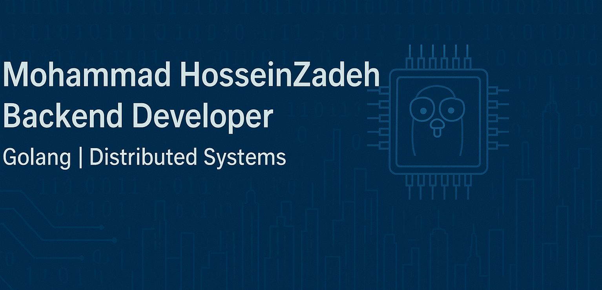

# 👋 Hi there! I'm Mohammad HosseinZadeh

## 🧑‍💻 About Me
- Backend developer with **3+ years of experience** in **Golang**
- Experienced in designing clean, efficient APIs and building security crawlers
- Passionate about performance, monitoring, and clean architectures
- Always curious and eager to learn, grow, and share knowledge 🚀

---

## 🔧 Skills & Technologies
- **Languages:** Golang, Python
- **Frameworks:** Echo
- **Databases:** MySQL, PostgreSQL, MongoDB
- **DevOps / Infrastructure:** Docker, Kubernetes, MinIO
- **Observability & Monitoring:** Jaeger, Prometheus, Grafana, Sentry, Asynqmon
- **Task Queues & Background Jobs:** Asynq
- **Load Testing:** Locust
- **Tools:** Postman, Git

---

## 📌 Projects
- **📡 Koomek Backend API**  
  Designed and implemented the backend for **Koomek**, a mobile app that helps users find trusted mechanics, book services, share reviews, and pay online.
    - Data layer with GORM
    - Background job processing with **Asynq** (monitored via Asynqmon)
    - Logging and monitoring with Jaeger, Sentry, Prometheus, Grafana
    - Load testing with Locust
    - Deployed on Kubernetes
    - The app now has **2000+ active users** on Android and iOS
    - [Koomek Website](https://koomek.com/)

- **🔍 Security Vulnerability Crawler**  
  Developed a crawler that monitored a public repository of newly disclosed security vulnerabilities in real time.
    - Fetched vulnerability data using Goquery
    - Stored results in **MongoDB**
    - Integrated with a custom-built web application:
        - Users could register their projects
        - The system checked if new vulnerabilities affected their dependencies
        - Sent real-time notifications via the website when a relevant vulnerability was detected

- **🐍 Python Crawlers (Earlier Work)**  
  Built multiple crawlers using **Selenium** and **BeautifulSoup4**, focusing on data extraction and automation tasks.

---

## 🌍 Open Source Contributions
- Contributed to [EchoX](https://github.com/labstack/echox) (an extension of the popular Echo framework for Golang)
    - Submitted multiple PRs that were successfully merged
    - Ranked among the **top 6 contributors** on the [contributors list](https://github.com/labstack/echox/graphs/contributors)

---

## 📫 Contact
- 📧 Email: MhzForWork@gmail.com
- 💼 [LinkedIn](https://www.linkedin.com/in/mohammad-hosseinzadeh-a05560196/)  
